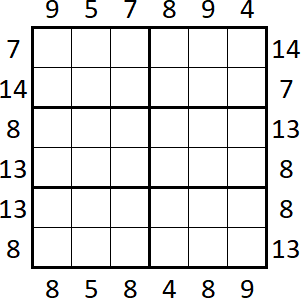
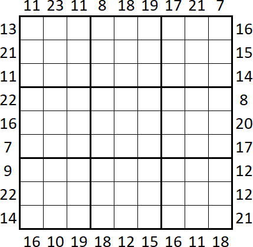
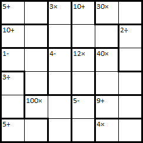
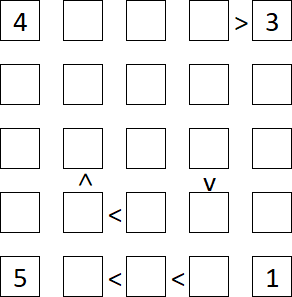

# Puzzle Solver

Solvers for various sudoku-like puzzles written in Java. All implementations use backtracking algorithm.


## List of solvers

- [Sudoku Solver](#sudoku-solver)
- [Frame Sudoku Solver](#frame-sudoku-solver)
- [Calcudoku Solver](#calcudoku-solver)
- [Futoshiki Solver](#futoshiki-solver)


## Sudoku Solver

[Wikipedia link](https://en.wikipedia.org/wiki/Sudoku)

This implementation supports any board size of second power (1×1, 4×4, 9×9, etc.).

### Constructor:

`SudokuSolver(int[][] board)`

- `board` - 2dim array of 0-N numbers (N = 9 is most common, 0 means empty)

### Example: *)


would be written as

```java
int[][] board = {
	{3, 0, 0, 8, 0, 9, 0, 0, 7},
	{0, 0, 1, 4, 0, 3, 6, 0, 0},
	{0, 5, 0, 1, 2, 6, 0, 3, 0},
	{6, 9, 5, 0, 0, 0, 8, 2, 1},
	{0, 0, 7, 0, 0, 0, 9, 0, 0},
	{2, 1, 3, 0, 0, 0, 7, 5, 4},
	{0, 4, 0, 2, 3, 5, 0, 7, 0},
	{0, 0, 6, 7, 0, 4, 5, 0, 0},
	{5, 0, 0, 6, 0, 1, 0, 0, 9},
};

Solver sudoku = new SudokuSolver(board);
```

To solve the puzzle use `solve()` method. There is a also useful `SolverPrinter.printBoard()` helper method to pretty-print the board:

```java
sudoku.solve();
SolverPrinter.printBoard(sudoku);

/* Outputs:
+-------+-------+-------+
| 3 6 4 | 8 5 9 | 2 1 7 |
| 8 2 1 | 4 7 3 | 6 9 5 |
| 7 5 9 | 1 2 6 | 4 3 8 |
+-------+-------+-------+
| 6 9 5 | 3 4 7 | 8 2 1 |
| 4 8 7 | 5 1 2 | 9 6 3 |
| 2 1 3 | 9 6 8 | 7 5 4 |
+-------+-------+-------+
| 9 4 8 | 2 3 5 | 1 7 6 |
| 1 3 6 | 7 9 4 | 5 8 2 |
| 5 7 2 | 6 8 1 | 3 4 9 |
+-------+-------+-------+
*/
```


## Frame Sudoku Solver

[dkmGames link](http://dkmgames.com/Sudoku/FrameSudoku.htm)

This implementation supports various region sizes - 3×3 but also 3×2 etc. (see examples below).

### Constructor:

`FrameSudokuSolver(int[][] board, int[][] sums)`

- `board` - 2dim array of 0-9 numbers (0 means empty)
- `sums` - 2dim array of 4 items:
	1. `int[]` of top sums
	2. `int[]` of bottom sums
	3. `int[]` of left sums
	4. `int[]` of right sums

### Examples: *)

#### 6×6 board, 3×2 region



would be written as

```java
int[][] sums = {
	{9, 5, 7, 8, 9, 4},
	{8, 5, 8, 4, 8, 9},
	{7, 14, 8, 13, 13, 8},
	{14, 7, 13, 8, 8, 13},
};

Solver frameSudoku = new FrameSudokuSolver(sums, 3, 2);
```

To solve the puzzle use `solve()` method. There is a also useful `SolverPrinter.printBoard()` helper method to pretty-print the board:

```java
frameSudoku.solve();
SolverPrinter.printBoard(frameSudoku);

/* Outputs:
+-------+-------+
| 4 2 1 | 6 5 3 |
| 5 3 6 | 2 4 1 |
+-------+-------+
| 1 5 2 | 4 3 6 |
| 3 6 4 | 5 1 2 |
+-------+-------+
| 6 4 3 | 1 2 5 |
| 2 1 5 | 3 6 4 |
+-------+-------+
*/
```

#### 9×9 board, 3×3 region



would be written as

```java
int[][] sums = {
	{11, 23, 11, 8, 18, 19, 17, 21, 7},
	{16, 10, 19, 18, 12, 15, 16, 11, 18},
	{13, 21, 11, 22, 16, 7, 9, 22, 14},
	{16, 15, 14, 8, 20, 17, 12, 12, 21},
};

Solver frameSudoku = new FrameSudokuSolver(sums, 3, 3);
```

To solve the puzzle use `solve()` method. There is a also useful `SolverPrinter.printBoard()` helper method to pretty-print the board:

```java
frameSudoku.solve();
SolverPrinter.printBoard(frameSudoku);

/* Outputs:
+-------+-------+-------+
| 3 8 2 | 4 7 5 | 9 6 1 |
| 7 9 5 | 1 2 6 | 3 8 4 |
| 1 6 4 | 3 9 8 | 5 7 2 |
+-------+-------+-------+
| 9 7 6 | 8 4 3 | 2 1 5 |
| 5 3 8 | 2 6 1 | 4 9 7 |
| 4 2 1 | 9 5 7 | 6 3 8 |
+-------+-------+-------+
| 2 4 3 | 7 8 9 | 1 5 6 |
| 8 5 9 | 6 1 4 | 7 2 3 |
| 6 1 7 | 5 3 2 | 8 4 9 |
+-------+-------+-------+
*/
```


## Calcudoku Solver

[Wikipedia link](https://en.wikipedia.org/wiki/KenKen)

### Constructor:

`CalcudokuSolver(int boardSize, int[][][] regions);`

- `boardSize` - size of the board
- `regions` - multidimensional array describing regions
  - each region is an array of `int[] {a, b}`
  - first item of each region is `int[] {<total>, <operation>}`
    - `total` - the total value of region
    - `operation` - fields operation for region - one of following:
      - `0` - for +
      - `1` - for -
      - `2` - for ×
      - `3` - for ÷
  - other region items are `int[] {<row>, <col>}` which are coordinates of fields that belong to that region

### Example: *)



would be written as

```java
int[][][] regions = {
	{{5, 0}, {0, 0}, {0, 1}},
	{{3, 2}, {0, 2}, {1, 2}},
	{{10, 0}, {0, 3}, {1, 3}, {1, 4}},
	{{30, 2}, {0, 4}, {0, 5}},
	{{10, 0}, {1, 0}, {1, 1}},
	{{2, 3}, {1, 5}, {2, 5}},
	{{1, 1}, {2, 0}, {2, 1}, {3, 1}},
	{{4, 1}, {2, 2}, {3, 2}},
	{{12, 2}, {2, 3}, {3, 3}},
	{{40, 2}, {2, 4}, {3, 4}, {3, 5}},
	{{3, 3}, {3, 0}, {4, 0}},
	{{100, 2}, {4, 1}, {4, 2}, {5, 2}},
	{{5, 1}, {4, 3}, {5, 3}},
	{{9, 0}, {4, 4}, {4, 5}},
	{{5, 0}, {5, 0}, {5, 1}},
	{{4, 2}, {5, 4}, {5, 5}},
};

Solver calcudoku = new CalcudokuSolver(6, regions);
```

To solve the puzzle use `solve()` method. There is a also useful `SolverPrinter.printBoard()` helper method to pretty-print the board:

```java
calcudoku.solve();
SolverPrinter.printBoard(calcudoku);

/* Outputs:
1 4 3 2 5 6
4 6 1 5 3 2
5 3 6 4 2 1
6 1 2 3 4 5
2 5 4 1 6 3
3 2 5 6 1 4
*/
```


## Futoshiki Solver

[Wikipedia link](https://en.wikipedia.org/wiki/Futoshiki)

### Constructor:

`FutoshikiSolver(int[][] board, int[][] relations)`

- `board` - 2dim array of 0-5 numbers (0 means empty)
- `relations` - 3dim array of coordinates of 2 fields - the first one is bigger than the second one, field `int[] {<row>, <col>}`

### Example: *)



would be written as

```java
int[][] board = {
	{4, 0, 0, 0, 3},
	{0, 0, 0, 0, 0},
	{0, 0, 0, 0, 0},
	{0, 0, 0, 0, 0},
	{5, 0, 0, 0, 1},
};

int[][][] relations = {
	{{0, 3}, {0, 4}},
	{{2, 3}, {3, 3}},
	{{3, 1}, {2, 1}},
	{{3, 2}, {3, 1}},
	{{4, 2}, {4, 1}},
	{{4, 3}, {4, 1}},
};

Solver futoshiki = new FutoshikiSolver(board, relations);
```

To solve the puzzle use `solve()` method. There is a also useful `SolverPrinter.printBoard()` helper method to pretty-print the board:

```java
futoshiki.solve();
SolverPrinter.printBoard(futoshiki);

/* Outputs:
4 1 2 5 3
2 5 1 3 4
1 3 4 2 5
3 4 5 1 2
5 2 3 4 1
*/
```


---

*) All examples taken from Gareth Moore's book [The Mammoth Book of Logical Brain Games](https://isbnsearch.org/isbn/9780762459841) which inspired me to create these solvers.
