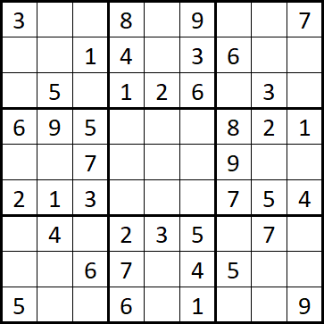

# Puzzle Solver

Solvers for various sudoku-like puzzles written in Java. All implementations use backtracking algorithm.


## List of solvers

- [Sudoku Solver](#sudoku-solver)


## Sudoku Solver

[Wikipedia link](https://en.wikipedia.org/wiki/Sudoku)

This implementation supports any board size of second power (1×1, 4×4, 9×9, etc.).

### Constructor:

`SudokuSolver(int[][] board)`

- `board` - 2dim array of 0-N numbers (N = 9 is most common, 0 means empty)

### Example: *)



would be written as

```java
int[][] board = {
	{3, 0, 0, 8, 0, 9, 0, 0, 7},
	{0, 0, 1, 4, 0, 3, 6, 0, 0},
	{0, 5, 0, 1, 2, 6, 0, 3, 0},
	{6, 9, 5, 0, 0, 0, 8, 2, 1},
	{0, 0, 7, 0, 0, 0, 9, 0, 0},
	{2, 1, 3, 0, 0, 0, 7, 5, 4},
	{0, 4, 0, 2, 3, 5, 0, 7, 0},
	{0, 0, 6, 7, 0, 4, 5, 0, 0},
	{5, 0, 0, 6, 0, 1, 0, 0, 9},
};

Solver sudoku = new SudokuSolver(board);
```

To solve the puzzle use `solve()` method. There is a also useful `SolverPrinter.printBoard()` helper method to pretty-print the board:

```java
sudoku.solve();
SolverPrinter.printBoard(sudoku);

/* Outputs:
+-------+-------+-------+
| 3 6 4 | 8 5 9 | 2 1 7 |
| 8 2 1 | 4 7 3 | 6 9 5 |
| 7 5 9 | 1 2 6 | 4 3 8 |
+-------+-------+-------+
| 6 9 5 | 3 4 7 | 8 2 1 |
| 4 8 7 | 5 1 2 | 9 6 3 |
| 2 1 3 | 9 6 8 | 7 5 4 |
+-------+-------+-------+
| 9 4 8 | 2 3 5 | 1 7 6 |
| 1 3 6 | 7 9 4 | 5 8 2 |
| 5 7 2 | 6 8 1 | 3 4 9 |
+-------+-------+-------+
*/
```


---

*) All examples taken from Gareth Moore's book [The Mammoth Book of Logical Brain Games](https://isbnsearch.org/isbn/9780762459841) which inspired me to create these solvers.
